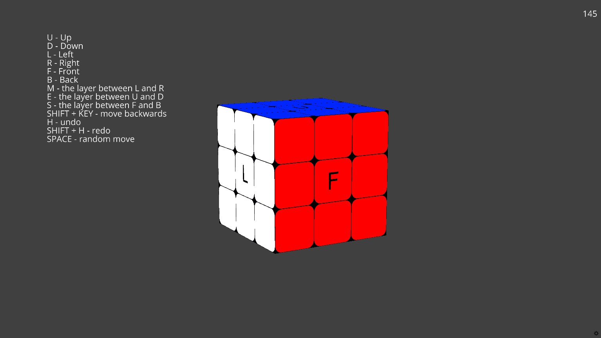

# Computer simulation of Rubik's Cube



Kewin Trochowski 188860

Oliwer Lisek 188947

## Introduction

This coding project implements a Rubik's Cube game using the Ursina game engine in Python. The game allows the player to interact with a 3D Rubik's Cube and manipulate its rotations to solve the puzzle. 


## Code Overview

The code is organized into a single class called RubiksCube, which represents the Rubik's Cube game. The class contains various methods for cube manipulation, history tracking, and user input handling.

## Initialization

The RubiksCube class initializes the game environment by creating the cube entities and setting their initial positions and textures. It also sets up dictionaries to map cube faces, axes, and textures.

```
if __name__ == '__main__':
    app = Ursina()
    game = RubiksCube()
    window.borderless = False
    window.exit_button.visible = False
    EditorCamera()
    txt = Text(text='...'
               , x=-0.75, y=0.4)
    app.run()
```

```commandline
class RubiksCube:

    def __init__(self):

        self.cubes = []
        self.history = []
        self.trigger = True
        self.history_index = 0
        self.cubes_left = {Vec3(-1, y, z) for y in range(-1, 2) for z in range(-1, 2)}
        self.cubes_down = {Vec3(x, -1, z) for x in range(-1, 2) for z in range(-1, 2)}
        self.cubes_front = {Vec3(x, y, -1) for x in range(-1, 2) for y in range(-1, 2)}
        self.cubes_back = {Vec3(x, y, 1) for x in range(-1, 2) for y in range(-1, 2)}
        self.cubes_right = {Vec3(1, y, z) for y in range(-1, 2) for z in range(-1, 2)}
        self.cubes_up = {Vec3(x, 1, z) for x in range(-1, 2) for z in range(-1, 2)}
        self.cubes_m = {Vec3(0, y, z) for y in range(-1, 2) for z in range(-1, 2)}
        self.cubes_e = {Vec3(x, 0, z) for x in range(-1, 2) for z in range(-1, 2)}
        self.cubes_s = {Vec3(x, y, 0) for x in range(-1, 2) for y in range(-1, 2)}

        self.dict_cubes = {
            'l': self.cubes_left,
            'r': self.cubes_right,
            'u': self.cubes_up,
            'd': self.cubes_down,
            'f': self.cubes_front,
            'b': self.cubes_back,
            'm': self.cubes_m,
            'e': self.cubes_e,
            's': self.cubes_s
        }

        self.dict_axis = {
            'l': 'rotation_x',
            'r': 'rotation_x',
            'm': 'rotation_x',
            'u': 'rotation_y',
            'd': 'rotation_y',
            'e': 'rotation_y',
            'f': 'rotation_z',
            'b': 'rotation_z',
            's': 'rotation_z'
        }

        for x in range(-1, 2):
            for y in range(-1, 2):
                for z in range(-1, 2):
                    self.cubes.append(Entity(model='models/custom_cube.obj', texture='textures/rubik_texture.png',
                                             position=(x, y, z)))

        self.cubes[12].texture = 'textures/front.png'
        self.cubes[4].texture = 'textures/left.png'
        self.cubes[14].texture = 'textures/back.png'
        self.cubes[22].texture = 'textures/right.png'
        self.cubes[10].texture = 'textures/down.png'
        self.cubes[16].texture = 'textures/up.png'
```

## Cube Manipulation

The RubiksCube class provides methods for cube rotation. The cube_rotation method performs the actual rotation of the cube entities based on the specified axis and angle. It also updates the cube's parent entity to achieve the rotation effect. The method takes into account the shift key modifier to determine the rotation direction and adds the move to the history.

```
 def cube_rotation(self, name, angle=0):

        self.trigger = False
        self.delete_parent()
        self.attach_parent(name)
        if held_keys['shift'] and angle == 0:
            angle = -90
        elif angle == 0:
            angle = 90

        self.add_move(name, -angle)

        if name in 'lrm':
            self.cubes[13].animate(self.dict_axis[name], self.cubes[13].rotation_x + angle, duration=.2)
        if name in 'ude':
            self.cubes[13].animate(self.dict_axis[name], self.cubes[13].rotation_y + angle, duration=.2)
        if name in 'fbs':
            self.cubes[13].animate(self.dict_axis[name], self.cubes[13].rotation_z + angle, duration=.2)

        invoke(self.change_trigger, delay=0.31)
```
Function 'invoke' is used to delay one rotation after another. Without it next rotation might have started during previous rotation resulting in incorrect effect.

## History Tracking

The game keeps track of the cube rotations in the history list. Each move is recorded as a tuple containing the axis and angle of rotation. The undo and redo methods allow the player to revert or replay previous moves by manipulating the cube's state and the history index.

```commandline
    def undo(self):
        if len(self.history) > 0 and self.history_index > 0:
            self.cube_rotation(self.history[self.history_index - 1][0], self.history[self.history_index - 1][1])
            self.history.pop()
            self.history_index -= 2

    def redo(self):
        if self.history_index < len(self.history):
            self.cube_rotation(self.history[self.history_index][0], -self.history[self.history_index][1])
            self.history.pop()
```

## User Input Handling
The input function handles user input events, such as key presses. It detects the keys corresponding to cube rotations, undo/redo actions, and random moves. It calls the appropriate methods in the RubiksCube class to perform the requested actions.

```commandline
def input(key):
    if key in 'lrufbdmes' and game.trigger:
        if game.history_index < len(game.history):
            game.delete_moves()
        game.cube_rotation(key)

    if key == 'h' and game.trigger:
        if held_keys['shift']:
            game.redo()
        else:
            game.undo()

    if key == 'space' and game.trigger:
        for i in range(1):
            if game.history_index < len(game.history):
                game.delete_moves()
            x = random.choice('lrufbdmes')
            game.cube_rotation(x)
```

## Controlling Cube

U, D, L, R, F, B, M, E, S: Perform cube rotations on respective faces.

Shift + Key: Perform a backward rotation on the specified face.

H: Undo the previous move.

Shift + H: Redo the previously undone move.

Space: Perform a random move.
